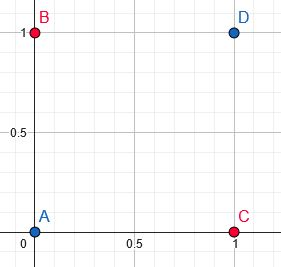
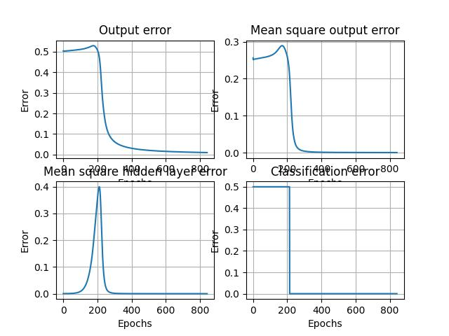
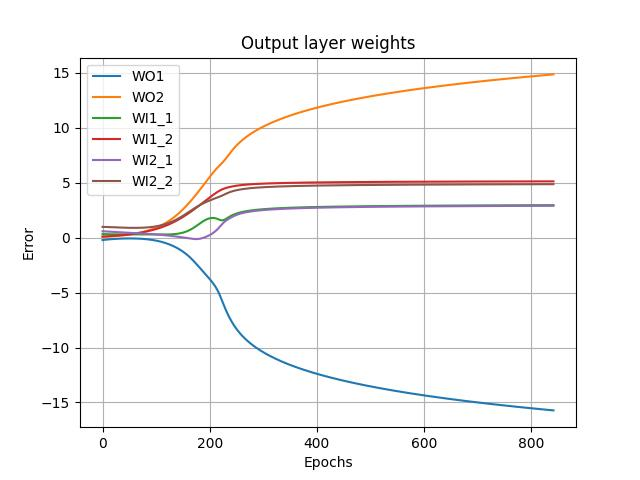
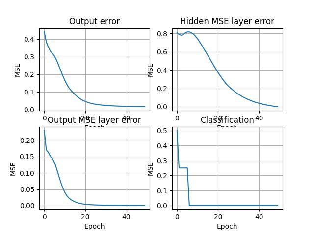

# XOR perceptron
## Table of contents

- [Introduction](#introduction)
    - [Perceptron](#perceptron)
    - [XOR problem](#xor-problem)
    - [Deep learning](#deep-learning)
    - [Connection between everyhing](#connection-between-perceptron-xor-and-deep-learning)
- [How to program](#how-to-program)
- [src](#src)
    - [1lay.py](#1-layer)
    - [2lay_sigmoid.py OR 2lay_ReLU.py](#2-layer-sigmoidrelu)
    - [2lay_sigm_reinforcementlearning.py](#2-layer-sigmoid-reinforcementlearning)
        - [Reinforcement learning](#reinforcement-learning)
        - [Backpropagation](#backpropagation)
    - [Comparison between 2 layer programs](#comparison-between-2-layer-programs)
- [Conclusion](#conclusion)
- [Additions](#additional-programs)
    - [2lay_more_features.py or 2lay_features_batch.py](#2-layer-with-features-and-batch)
    - [2lay_best.py](#2-layer-best)

## Introduction
Perceptrons, XOR, and deep learning are foundational concepts in the field of artificial intelligence and machine learning. Understanding them provides insights into the evolution of neural network architectures and their capabilities.

### Perceptron:
The perceptron, introduced by Frank Rosenblatt in the late 1950s, is one of the earliest forms of artificial neural networks. It is a binary classifier that takes multiple input signals, applies weights to them, and produces an output based on a threshold function. Perceptrons have a single layer and can only solve linearly separable problems, meaning they can't learn patterns that aren't linearly separable.

### XOR Problem:
The XOR (exclusive OR) problem is a classic example that illustrates the limitations of single-layer perceptrons. XOR is a binary function that outputs true only when the number of true inputs is odd. The XOR problem is not linearly separable, meaning a single-layer perceptron cannot learn to correctly classify its inputs.

### Deep Learning:
Deep learning is a subfield of machine learning focused on artificial neural networks with multiple layers (deep neural networks). Unlike single-layer perceptrons, deep neural networks can learn intricate and non-linear patterns from data. By stacking multiple layers of neurons, deep learning models can extract hierarchical representations of features, enabling them to solve complex problems efficiently.

### Connection between Perceptron, XOR, and Deep Learning:
The XOR problem played a significant role in the history of artificial neural networks. When researchers attempted to train single-layer perceptrons to solve XOR, they discovered its limitations. However, the introduction of multi-layer perceptrons (deep neural networks) with hidden layers allowed researchers to overcome these limitations and successfully solve the XOR problem. This breakthrough paved the way for the development of deep learning, which has revolutionized various fields, including computer vision, natural language processing, and speech recognition.

## How to program
Main functions needed to create a deep learning program:

#### Load Data
This function loads and preprocesses the dataset needed for training the deep learning model.

#### Build Model
This function defines and initializes the architecture of the deep learning model. It includes specifying the layers, activation functions, and any other necessary components.

#### Train Model
This function trains the deep learning model using the training data. It involves iteratively updating the model parameters (weights and biases) to minimize the loss function on the training data.

#### Evaluate Model
This function evaluates the performance of the trained model on a separate set of test data. It calculates metrics such as accuracy, precision, recall, or others depending on the problem domain.

#### Main
The main function orchestrates the entire deep learning pipeline. It calls the load data function to prepare the dataset, builds the model, trains it using the training data, and finally evaluates its performance on the test data.

## 1 layer
It is the default Rosenblatt perceptron with only one layer that can solve some easy liner problems as written above. The problem within solving XOR with such perceptron outputs shown on cartesian plane:

    

|Point      |Coordinates| XOR Output|
|-----------|-----------|-----------|
|A          |(0,0)      |0          |
|B          |(1,0)      |1          |
|C          |(0,1)      |1          |
|D          |(1,1)      |0          |

As we know the plane should devide those points into two groups so that two of them stay in group 0 and other two become group 1. Example plane:

    

We can see that it is impossible to devide the plane into only two parts. But one layered perceptron can do only that particular thing. Let's check what will hapen with 2 layers then:

## 2 layer sigmoid/ReLU
By introducing more layered perceptrons people started to solve more and more complex questions that were impossible with only one layer such as XOR problem. It can be solved in couple of ways depending on hidden layers coefficients. 

    
    

As we see layers adds up as another linear functions and as we progress with hidden layers we can build more and more complex functions. But sometimes depending on initialized random input, not optimal way to learn or simply by wrong activation method the output could be as shown below.

    

Now the output is going to be 0100 insted of 0110, the problem occurs much more in ReLU (rectified linear unit) function, just because of using wrong activation method. The main reason is the first part of the equation when everyhing below 0 for X axis is going to be 0. The problem can be countered by inserting specific wages and biases, but for random generated ones it is difficult to get consistently good performance.

## 2 layer sigmoid reinforcementlearning
For better data usage and performance use:

#### Reinforcement learning [Click for more info](https://en.wikipedia.org/wiki/Reinforcement_learning)
Reinforcement learning is a type of machine learning paradigm inspired by the way humans and animals learn through trial and error. In reinforcement learning, an agent interacts with an environment, learning to make decisions by receiving feedback in the form of rewards or penalties. The goal of the agent is to maximize cumulative rewards over time by discovering optimal strategies or policies. Reinforcement learning has found applications in various domains, including robotics, game playing, autonomous vehicles, and recommendation systems.

#### Backpropagation [Click for more info](https://en.wikipedia.org/wiki/Backpropagation)
Backpropagation is a fundamental algorithm for training artificial neural networks, enabling them to learn from labeled data. It is based on the principle of gradient descent, where the network's weights are adjusted iteratively to minimize a predefined loss function. Backpropagation works by computing the gradient of the loss function with respect to each weight in the network, propagating this gradient backward through the network, and then updating the weights accordingly. This iterative process allows neural networks to learn complex patterns and make accurate predictions on unseen data. Backpropagation has played a crucial role in the success of deep learning, enabling the training of deep neural networks with multiple layers.
In **2lay_sigm_teacher.py** it is made by evaluating derivative function from sigmoid and by depending on it calculating new biases and weights. derivative_sigmoid function shown below:

    

## Comparison between 2 layer programs
Simply to illustrate the impact of employing teacher-forcing and backpropagation with derivative adjustments, two plots are presented. The initial plot depicts the error function across epochs, indicating that it requires 6000 epochs to reach an error level of 0.1. In contrast, the second plot includes backpropagation and a teacher signal. Here, the epochs required to achieve the same error level plummet to only 1400. This signifies a significant reduction of over fourfold.

    
    

## Conclusion
In conclusion, the single-layer perceptron with or without reinforcement learning offers a straightforward approach to binary classification tasks. While its simplicity makes it easy to implement and interpret, its limitations become apparent when faced with complex, non-linearly separable datasets. However, by incorporating reinforcement learning, the model can adapt and improve its performance over time, making it a versatile tool for certain applications.

In summary, the double-layer perceptron with backpropagation provides a powerful framework for addressing more complex classification and regression problems. By utilizing multiple layers of neurons and the backpropagation algorithm, the model can learn intricate patterns in the data and make accurate predictions. While training can be computationally intensive and prone to overfitting, careful regularization techniques can mitigate these challenges, resulting in a robust and flexible neural network model.

## Additional programs
Everything above is sufficient.... BUT it can be done better so I wanted to push the program to it limits. There are three additional programs:

### 2 layer with features and batch
This program is showimg more plots with errors and weights, changes in code from above 2 layer perceptrons: 

**Momentum** - Momentum is a technique used in machine learning optimization algorithms, particularly in gradient-based optimization methods such as gradient descent, to accelerate convergence and escape local minima. It's particularly useful in training deep neural networks. 

**Mini-batch** - In deep learning, mini-batch refers to a subset of the training data used to compute the gradient descent update for the model parameters during training. Instead of using the entire dataset at once, which can be computationally expensive and memory-intensive, the training data is divided into smaller batches. 

**Adaptive learning coefficient** - Adaptive learning rate methods address this challenge by dynamically adjusting the learning rate according to the behavior of the optimization process. These methods aim to make larger updates to the parameters when the gradients are large and smaller updates when the gradients are small, which can lead to faster convergence and better generalization performance.

For comparison with previous programs:

    
    

### 2 layer best
At last I wanted to put the program to the limit how many epochs is needed to learn, so that i made, a program to cut off as many as possible. Addons in program:

**Weight Initialization**: The weights are initialized using He initialization, which is a technique designed to ensure that the weights are initialized in such a way that they are neither too large nor too small, helping to prevent vanishing or exploding gradients.

**Mini-batch Gradient Descent**: The training process employs mini-batch gradient descent, which updates the weights and biases using gradients computed on small subsets of the training data (mini-batches). This approach can improve convergence speed and memory efficiency compared to batch gradient descent.

**Adaptive Learning Rate (Adam Optimizer)**: The learning rate is adaptively adjusted during training using the Adam optimizer, which combines the concepts of momentum and adaptive learning rates. It maintains per-parameter learning rates and adapts them based on the first and second moments of the gradients.

**Momentum**: Momentum is incorporated into the optimization process to accelerate convergence. It introduces a velocity term that accumulates gradients over time, allowing the optimizer to continue in the direction of the previous updates with a certain momentum.

**ReLU Activation Function**: Rectified Linear Unit (ReLU) activation functions are used in the hidden layers of the neural network. ReLU has become a popular choice due to its simplicity and ability to alleviate the vanishing gradient problem.

**Sigmoid Activation Function**: Sigmoid activation functions are used in the output layer to squash the output values to the range [0, 1], suitable for binary classification tasks.

**Early Stopping**: The training loop includes a condition to stop training early if the output loss falls below a certain threshold, which can prevent overfitting and save computational resources.

Same as befor for comparison:

    
    

